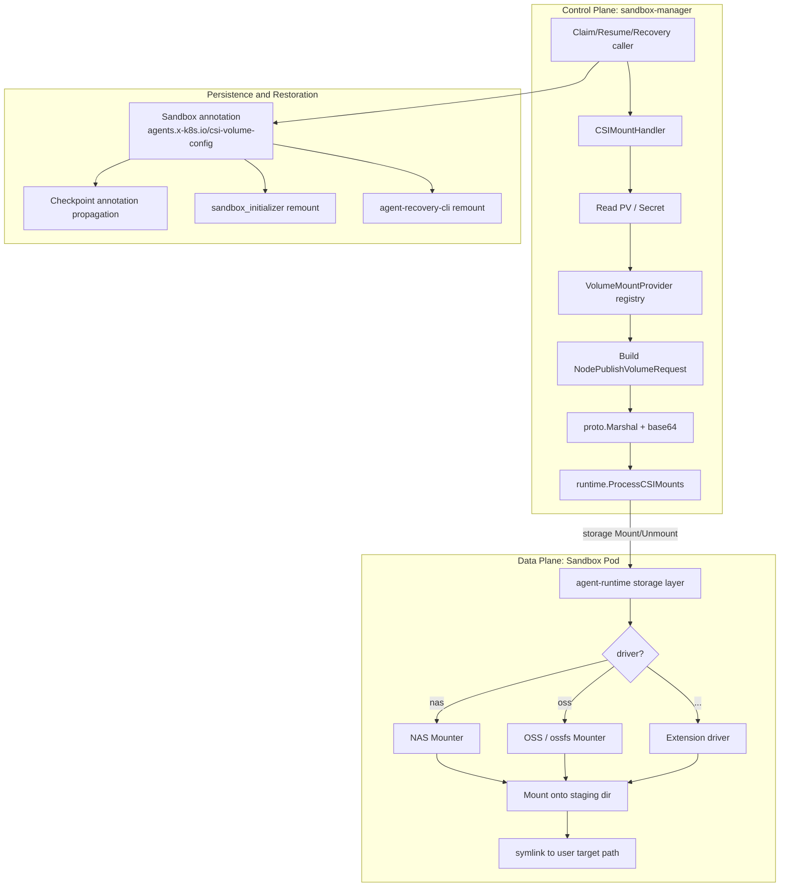

# On-Demand CSI Volume Mount in Sandbox Runtime

| Metadata | Details |
|----------|---------|
| **Authors** | jicheng.sk <jicheng.sk@alibaba-inc.com>, @mowangdk, @ZeroCoder-dot |
| **Status** | Provisional |
| **Created** | 2026-06-08 |
| **Updated** | 2026-07-20 |
| **Related Components** | sandbox-manager, agent-sandbox-controller, agent-runtime |

## Table of Contents

- [Summary](#summary)
- [Motivation](#motivation)
  - [Goals](#goals)
  - [Non-Goals](#non-goals)
- [Proposal](#proposal)
  - [User Stories](#user-stories)
  - [Architecture Overview](#architecture-overview)
  - [API Design](#api-design)
  - [Implementation Details](#implementation-details)
    - [1. Primary Claim Path Integration](#1-primary-claim-path-integration)
    - [2. Hibernate/Resume and In-Place Upgrade Path](#2-hibernateresume-and-in-place-upgrade-path)
    - [3. Checkpoint / Clone Path](#3-checkpoint--clone-path)
    - [4. Storage Interface Inside Sandbox Runtime](#4-storage-interface-inside-sandbox-runtime)
    - [5. The `sandbox-storage` Binary Plugin](#5-the-sandbox-storage-binary-plugin)
    - [6. Multi-Driver Support (NAS / OSS / Extensions)](#6-multi-driver-support-nas--oss--extensions)
    - [7. Sub-Path and Read-Only Controls](#7-sub-path-and-read-only-controls)
    - [8. Concurrency and Error Aggregation](#8-concurrency-and-error-aggregation)
- [Security](#security)
- [Observability](#observability)
- [Compatibility and Upgrade Strategy](#compatibility-and-upgrade-strategy)
- [Alternatives](#alternatives)
- [Test Plan](#test-plan)
- [Implementation History](#implementation-history)

## Summary

This proposal introduces **On-Demand CSI Volume Mount** capability to OpenKruise Agents Sandbox runtime.
By carrying a lightweight "PV reference + in-container mount point" descriptor on the Sandbox CR,
sandbox-manager can — *after* the Sandbox Pod is already running — remotely trigger mount and unmount
operations inside the Sandbox via the agent-runtime storage interface (`Mount` / `Unmount`). This
enables runtime, on-demand, multi-volume attachment and detachment of one or more persistent volumes
(NAS, OSS, etc.), with consistent semantics across the primary Claim path, hibernate/resume,
checkpoint restoration, and the recovery CLI.

In contrast to the upstream model, which relies on `volumes` / `volumeMounts` statically declared in
the Pod spec, this design decouples the *mount intent* from Pod creation and injects it dynamically
as part of the Sandbox Claim. The same pooled Sandbox template can therefore serve different tenants
with different storage topologies, dramatically reducing SandboxSet template fragmentation and cold-start
overhead.

## Motivation

A core value proposition of OpenKruise Agents is the ability to serve a **pre-warmed, rapidly
allocatable Sandbox pool** through SandboxSet. In production we observe sharply differentiated
persistent-storage requirements across business lines and Agent flavors:

1. **Heterogeneous mount content per Agent.** Two callers of the same code-interpreter template may
   need to mount `oss://bucket-a/userX/` versus `nas://share-b/projectY/`, with a fresh `subPath`
   per Claim.
2. **Tenant- or session-scoped mount granularity.** A single Sandbox may need to mount different
   directories across sessions; expressing this through Pod spec leads to combinatorial explosion of
   SandboxSet template versions and renders the warm pool useless.
3. **Mount intent is only known after the Pod is ready.** During the Claim flow the caller supplies
   the mount intent, but at that point the Pod has already been created from the warm pool, and we
   cannot mutate the PodSpec via the apiserver.
4. **Hibernate/resume and checkpoint restoration must round-trip mounts.** After a Sandbox is
   hibernated and recreated (new Pod, new PodUID), prior CSI mounts vanish with the old Pod and
   must be reproduced on the new Pod identically.
5. **Heterogeneous storage drivers need a unified abstraction.** NAS, OSS (ossfs), and similar
   drivers expect different `NodePublishVolumeRequest` field shapes, calling for a pluggable
   provider registry.
6. **Reuse Kubernetes' PV/Secret model.** Callers must not place endpoints or AK/SK directly on the
   Sandbox CR; instead they reference a standard PV, and the platform translates "PV → CSI Request"
   while assembling sensitive material.
7. **STS-Token short-lived identity.** In addition to traditional static AK/SK credentials, the
   platform supports CSI mount authentication via STS (Security Token Service) tokens. This aligns
   with the [Security Identity Provider proposal](./20260427-security-identity-provider.md): the
   platform requests a Sandbox/Agent-bound STS token (containing `accessKeyId`, `accessKeySecret`,
   `securityToken`) through the unified `IdentityProvider` interface, then injects the temporary
   credential into the `secrets` field of the CSI `NodePublishVolumeRequest`. This delivers
   on-demand, time-bound, auditable storage access.

The current upstream Pod-spec-static model satisfies none of the above simultaneously. This proposal
therefore introduces a unified runtime-on-demand-mount design.

### Goals

- Allow sandbox-manager to remotely trigger mount actions inside an already-running Sandbox Pod,
  attaching one or more remote storage volumes (described by PVs) to in-container directories.
- Provide a unified `CSIMountConfig` API exposing only the minimal user-facing surface — *PV name +
  in-container mount point + sub-path + read-only flag* — while delegating sensitive material to
  PV/Secret.
- Provide a pluggable `VolumeMountProvider` registry. The community baseline ships NAS and OSS
  providers; enterprises can register custom drivers; a generic, fully community-implementable
  provider covers the long tail.
- Preserve consistent mount semantics across four paths: primary Claim, hibernate/resume and in-place
  upgrade, checkpoint restoration, and recovery CLI.
- Use the agent-runtime storage interface (`Mount` / `Unmount`) as the data-plane, avoiding any new
  sidecars or new wire protocols.
- Support concurrent multi-volume mount with aggregated failure reporting (`errors.Join`) for
  diagnosability.
- Support STS-token short-lived credentials end-to-end: `CSIMountHandler` reads
  `accessKeyId` / `accessKeySecret` / `securityToken` from the associated Secret when present and
  injects them into the CSI Request, replacing long-lived AK/SK. This mechanism shares its token
  lifecycle (issuance, propagation, automatic refresh) with the Security Identity Provider
  framework.

### Non-Goals

- This proposal defines a pluggable CSI Provider plugin framework. Any driver that conforms to the
  CSI specification and the `NodePublishVolumeRequest` exchange protocol can be plugged in; we do
  not bind to a specific CSI Driver implementation.
- This proposal does **not** replace the static `volumes` / `volumeMounts` already expressed in the
  Pod spec. The two coexist: static declarations express *template-wide common mounts*, on-demand
  mounts express *session-specific, differentiated mounts*.

> **Note**: This proposal covers the full mount-and-unmount lifecycle, including two unmount
> scenarios: (1) the controller automatically unmounts when the Sandbox is deleted, releasing
> node-side mount points and credential material; and (2) users invoke an explicit unmount through
> sandbox-manager's API to release one or more `CSIMountConfig` entries on demand. The "mount →
> refresh → unmount" loop closes end-to-end within this iteration.

## Proposal

### User Stories

| Scenario | Role | Requirement | Core Benefit |
|----------|------|-------------|--------------|
| **Session-level data isolation** | Agent user | Same code-interpreter template, each session mounts its own OSS sub-directory | One SandboxSet serves multi-tenant traffic; no per-directory template proliferation |
| **Cross-Agent data sharing** | Platform operator | Multiple Agents share the same NAS dataset, read-only | PV + readOnly captures both intent and credentials uniformly |
| **Transparent hibernate/resume** | Agent user | After hibernate/resume the original mount points remain readable/writable | Annotation persistence + controller re-mount keeps the user experience seamless |
| **Checkpoint mount cloning** | Platform operator | Sandboxes cloned from a checkpoint automatically restore the original mount topology | Annotations propagate through Checkpoint, mount intent travels with the snapshot |
| **Recovery-CLI rescue** | Platform operator | After node eviction, CLI relifts a Sandbox to a new node with mounts reconstructed | CLI reuses the same `CSIMountHandler` pipeline |

### Architecture Overview

**Component-level call flow** — the following mermaid diagram illustrates the control-plane to data-plane invocation chain and the persistence and restoration paths:



**Container runtime layer** — the diagram below zooms into the sandbox pod and illustrates the sidecar relationship, mount propagation paths, and where the CSI mount occurs:


### API Design

#### 1. User-facing API: `CSIMountConfig`

Defined in `api/v1alpha1/mount_types.go`, this is the minimal contract of the entire design:

```go
type CSIMountConfig struct {
    MountID   string `json:"mountID,omitempty"`  // optional, caller-side identifier
    PvName    string `json:"pvName"`             // required, references a cluster PV
    MountPath string `json:"mountPath"`          // required, in-container target mount path
    SubPath   string `json:"subPath,omitempty"`  // optional, sub-path inside the PV
    ReadOnly  bool   `json:"readOnly,omitempty"` // optional, read-only mode
}
```

Design notes:

- **No endpoints or credentials are exposed.** All sensitive material flows through `Spec.CSI` and
  `NodePublishSecretRef` on the PV; callers only supply a PV name.
- **Two credential modes are supported via Secret:**
  - **Static AK/SK mode.** The PV's `NodePublishSecretRef` references a standard Secret carrying
    `accessKeyID` / `accessKeySecret` — appropriate for long-lived credentials.
  - **STS-token short-lived mode.** The Secret carries
    `accessKeyID` / `accessKeySecret` / `securityToken`, dynamically issued by the
    [Security Identity Provider](./20260427-security-identity-provider.md). When `CSIMountHandler`
    detects the `securityToken` field, it injects it into
    `NodePublishVolumeRequest.Secrets["securityToken"]`, after which the CSI plugin authenticates
    using the temporary identity.
- **Lifecycle alignment with Security Identity Provider.** In STS mode,
  `IdentityProvider.IssueToken` issues the *user identity* bound to the current Sandbox session — a
  caller-role STS credential triple (`accessKeyID` / `accessKeySecret` / `securityToken`) whose
  validity is conveyed by the `AccessTokenExpiration` field. The platform's built-in token-refresh
  controller automatically re-issues the identity token when expiration approaches;
  `CSIMountHandler` reads the latest credentials on the next mount or remount. The architecture
  guarantees that **CSI mount credentials are always temporary tokens**, structurally precluding
  long-lived AK/SK residence (see the [Security](#security) section for the credential refresh
  policy).
- **`MountPath` is the in-container path**, with the same semantics as Pod spec's `volumeMounts`.
- **`SubPath` is merged with the PV's `VolumeAttributes.path`** by sandbox-manager when synthesizing
  the request, with `..` and null-byte traversal vectors rejected (see `mergeAndValidatePaths` /
  `validateRelativePath`).
- A Sandbox may carry multiple `CSIMountConfig` entries simultaneously; the list is persisted in
  the annotation `agents.x-k8s.io/csi-volume-config` as a JSON array.

#### 2. Control plane: `CSIMountHandler`

Defined in `pkg/utils/csiutils/storages_provider.go`, responsible for the "PV → CSI Request"
translation:

```go
type CSIMountHandler struct {
    client          ctrlclient.Client
    apiReader       ctrlclient.Reader
    storageRegistry storages.VolumeMountProviderRegistry
    systemNamespace string
}

// Returns the driver name and a base64(proto-marshalled NodePublishVolumeRequest).
func (h *CSIMountHandler) CSIMountOptionsConfig(
    ctx context.Context, mountRequest v1alpha1.CSIMountConfig,
) (driver string, configB64 string, err error)
```

Key constraints:

- **Static AK/SK mode.** The PV's `Spec.CSI.NodePublishSecretRef.Namespace` must equal the platform
  `systemNamespace` (default `sandbox-system`). This bounds the read scope of long-lived
  credentials and rejects cross-namespace Secret access. In STS-token mode, credentials are issued
  dynamically by the Security Identity Provider rather than read from a pre-provisioned Secret.
- Driver availability is verified through
  `storages.VolumeMountProviderRegistry.IsSupported(driverName)`; unregistered drivers are rejected
  immediately.
- **STS-token credential injection.** When `CSIMountHandler` detects a `securityToken` field
  (distinguishing it from static AK/SK mode), it auto-injects it into
  `NodePublishVolumeRequest.Secrets["securityToken"]`. This field is the canonical signal that
  Aliyun CSI plugins (and similar implementations) interpret as a temporary STS identity; the CSI
  plugin then uses the STS token in lieu of long-lived AK/SK to authenticate the mount. The
  `securityToken` itself is rotated by the Security Identity Provider's token-refresh controller
  (see the [Security](#security) section, item 6).

#### 3. Driver registry: `VolumeMountProvider`

Defined in `pkg/agent-runtime/storages/interface.go`:

```go
type VolumeMountProvider interface {
    GenerateCSINodePublishVolumeRequest(
        ctx context.Context,
        containerMountTarget string,
        persistentVolumeObj *corev1.PersistentVolume, readOnly bool,
        secretObj *corev1.Secret,
    ) (*csi.NodePublishVolumeRequest, error)
}

type VolumeMountProviderRegistry interface {
    RegisterProvider(driverName string, provider VolumeMountProvider)
    GetProvider(driverName string) (VolumeMountProvider, bool)
    IsSupported(driverName string) bool
}
```

The community baseline supplies a generic `MountProvider` that maps PV fields
(`Spec.CSI.FSType` / `MountOptions` / `VolumeAttributes` / `AccessModes`, etc.) onto a CSI
`NodePublishVolumeRequest`. Driver names are loaded into the registry through the environment
variable `ENV_DYNAMIC_STORAGE_DRIVER_LIST`, allowing different deployment topologies to ship
distinct driver bundles.

#### 4. Execution channel: `runtime.ProcessCSIMounts` / `ProcessCSIUnmounts`

Defined in `pkg/utils/runtime/csi.go`, the unified entry point from sandbox-manager into the
Sandbox Pod:

```go
func ProcessCSIMounts(ctx context.Context, sbx *agentsv1alpha1.Sandbox, opts config.CSIMountOptions) (time.Duration, error)
func CSIMount(ctx context.Context, sbx *agentsv1alpha1.Sandbox, driver, request string) error
func ProcessCSIUnmounts(ctx context.Context, sbx *agentsv1alpha1.Sandbox, opts config.CSIUnmountOptions) error
```

Each mount/unmount unit is dispatched through agent-runtime's storage interface with the following
call shape:

```text
Mount(driver=<driverName>, config=<base64(proto(NodePublishVolumeRequest))>, podUID=<PodUID>)
Unmount(driver=<driverName>, targetPath=<containerMountPath>)
```

`POD_UID` is forwarded to the CSI plugin via `csi.storage.k8s.io/pod.uid`, a field that several CSI
implementations require to validate the legitimacy of the call.

#### 5. Persistence annotation

```go
// agents.x-k8s.io/csi-volume-config
const AnnotationCSIVolumeConfig = E2BPrefix + "csi-volume-config"
```

The annotation stores `[]CSIMountConfig` as a JSON array. It is the single source of truth that
makes "stateless controller, state carried in CR annotations" practical, and is read in three
places:

1. The controller's `sandbox_initializer.Initialize` — re-mount after Pod recreation
   (resume, in-place upgrade recreate);
2. `checkpoint_utils.PropagateAnnotationsToCheckpoint` — propagate the annotation verbatim into the
   Checkpoint so that cloned Sandboxes inherit the mount topology;
3. `agent-recovery-cli` — reconstruct mounts during cross-node recovery from the same annotation.

### Implementation Details

#### 1. Primary Claim Path Integration

`pkg/sandbox-manager/infra/sandboxcr/claim.go` performs the CSI mount as the final step of Claim,
after the Sandbox is locked and the Pod is Ready:

```go
// claim.go (excerpt)
if opts.CSIMount != nil {
    log.Info("starting to perform csi mount")
    metrics.CSIMount, err = runtime.ProcessCSIMounts(ctx, sbx.Sandbox, *opts.CSIMount)
    if err != nil {
        return fmt.Errorf("failed to perform csi mount: %s", err)
    }
}
```

Immediately after, `modifyPickedSandbox` writes the original `MountOptionListRaw` (the JSON
serialization of `[]CSIMountConfig`) into `AnnotationCSIVolumeConfig` to back up the intent for
later remount logic:

```go
if opts.CSIMount != nil && opts.CSIMount.MountOptionListRaw != "" {
    annotations[models.ExtensionKeyClaimWithCSIMount_MountConfig] = opts.CSIMount.MountOptionListRaw
}
```

The "mount first, then persist intent" ordering guarantees that the annotation never gets ahead of
runtime reality.

#### 2. Hibernate/Resume and In-Place Upgrade Path

`pkg/controller/sandbox/core/sandbox_initializer.go` is invoked by the Sandbox controller after Pod
recreation (hibernate→resume, recreate-upgrade). Its `Initialize` step re-issues the CSI mounts:

```go
csiMountConfigRequests, _ := utilruntime.GetCsiMountExtensionRequest(box) // read annotation
csiMountHandler := csimountutils.NewCSIMountHandler(client, apiReader, storageRegistry, sandboxNs)
for _, req := range csiMountConfigRequests {
    driver, raw, _ := csiMountHandler.CSIMountOptionsConfig(ctx, req)
    mountOptionList = append(mountOptionList, config.MountConfig{Driver: driver, RequestRaw: raw})
}
duration, err := utilruntime.ProcessCSIMounts(ctx, sbxForInit, config.CSIMountOptions{MountOptionList: mountOptionList})
```

By reusing the very same `CSIMountHandler` and dispatch helpers used by the control plane, the
primary Claim path and the remount path follow identical behavior at every layer — PV resolution,
authentication, request synthesis, and runtime execution.

#### 3. Checkpoint / Clone Path

`pkg/sandbox-manager/infra/sandboxcr/checkpoint_utils.go` whitelists the annotations that must
travel with the snapshot and copies them onto the Checkpoint CR:

```go
var necessaryAnnotationKeys = []string{
    v1alpha1.AnnotationCSIVolumeConfig,
}
```

This means: mount topology declared on Sandbox A → Checkpoint X → Sandbox B cloned from X
automatically restores the same intent. Once Pod Ready fires for the first time on the cloned
Sandbox, `sandbox_initializer.Initialize` performs the inaugural mount, mirroring the resume path.

#### 4. Storage Interface Inside Sandbox Runtime

agent-runtime exposes `Mount` and `Unmount` operations through its storage interface. The
underlying implementation can be swapped between runtime variants while remaining fully decoupled
from the control plane. The contract is:

```text
Mount(driver=<name>, config=<base64(NodePublishVolumeRequest)>, podUID=<uid>)
Unmount(driver=<name>, targetPath=<containerMountPath>)
```

Mount execution flow:

1. base64-decode `config` → `proto.Unmarshal` → `csi.NodePublishVolumeRequest`;
2. If `VolumeContext["csi.storage.k8s.io/pod.uid"]` is empty, fall back to the `podUID` argument;
3. Validate generic required fields (Pod UID, etc.) and driver-specific required fields (NAS:
   `server`/`accessPoint` + `path`; OSS: `bucket`, `url`, `akId`, `akSecret`);
4. Normalize the in-Pod target directory: `<mountRoot>/<driver>/md5(originTargetPath)` — preventing
   in-container mount collisions;
5. Invoke the driver-specific handler to perform the mount;
6. Create a symlink: `originTargetPath` → real mount directory, exposing a stable path to user
   processes.

Unmount execution flow:

1. Locate the staging directory from `targetPath`: `<mountRoot>/<driver>/md5(targetPath)`;
2. Invoke the driver-specific handler to unmount, releasing the mount point;
3. Clean up the symlink and the staging directory.

This "staging directory + symlink" two-step keeps the on-demand mount stably exposed to user
processes without disturbing pre-existing files or mounts at the original directory.

> **Implementation roadmap.** The current agent-runtime drives mount/unmount through `envd`'s
> `remote.RunCommand`, invoking a pre-baked custom binary (`sandbox-storage`) inside the Sandbox —
> a "command-proxy" model. A future iteration of agent-runtime will fold the mount/unmount logic
> directly into the agent-runtime process, eliminating the external binary entirely. The storage
> interface abstraction is reserved precisely as a swap point — upper-layer callers need not be
> aware of the underlying implementation. The current `sandbox-storage` binary will be open-sourced
> together with the next community release, allowing community users to deploy the command-proxy
> model directly.

#### 5. The `sandbox-storage` Binary Plugin

`sandbox-storage` is the current command-proxy implementation of agent-runtime's storage
interface: agent-runtime invokes the pre-baked binary inside the Sandbox Pod through envd
`remote.RunCommand` to perform the actual mount/unmount. The plugin currently serves as a complete,
working reference implementation (planned for open-source release alongside the next community
version). Once agent-runtime ships its in-process runtime, the binary's role on the data plane will
be replaced by an in-process implementation, but the **protocol contract (CLI flags +
bidirectional-propagation mount mechanism) remains stable.**

##### 5.1 CLI Contract

The binary exposes only three subcommands and two global flags:

```text
sandbox-storage mount   --driver=<driverName>  --config=<base64(proto(NodePublishVolumeRequest))>
sandbox-storage unmount --driver=<driverName>  --config=<base64(proto(NodePublishVolumeRequest))>
sandbox-storage version
```

| Flag | Type | Meaning |
|------|------|---------|
| `--driver` / `-d` | string | CSI driver name. Currently `nasplugin.csi.alibabacloud.com`, `ossplugin.csi.alibabacloud.com`; extensible via registration |
| `--config` / `-c` | string | base64 encoding of the proto-marshalled `csi.NodePublishVolumeRequest`, carrying VolumeId, VolumeContext, Secrets, TargetPath, Readonly, StagingTargetPath, etc. |

By shipping the entire CSI request as a single base64 string, the binary need not understand any
driver-specific field shape — **the wire protocol is fixed; drivers are extensible.**

##### 5.2 Round-Trip with `NodePublishVolumeRequest`

The control plane (`CSIMountHandler`) and the data plane (`sandbox-storage`) round-trip
losslessly via the standard CSI `NodePublishVolumeRequest`:

```text
[control plane: sandbox-manager]                          [data plane: Sandbox Pod]
  PV + Secret + CSIMountConfig                              sandbox-storage mount --driver --config
        │                                                            │
        ▼                                                            ▼
  CSIMountHandler.CSIMountOptionsConfig                      base64.StdEncoding.DecodeString(config)
        │                                                            │
        ▼                                                            ▼
  build csi.NodePublishVolumeRequest                          proto.Unmarshal(raw, &csiReq)
        │                                                            │
        ▼                                                            ▼
  proto.Marshal → base64 ───── envd RunCommand ─────────────► validate + remap TargetPath
                                                                     │
                                                                     ▼
                                                          gRPC NodePublishVolume(csi.sock)
```

Field semantics:

- **`VolumeId` / `PublishContext` / `VolumeContext`.** Derived by the control plane from PV
  `Spec.CSI` and `VolumeAttributes`; the data plane forwards them verbatim to the CSI driver. The
  binary never alters business-level semantics.
- **`Secrets`.** In static AK/SK mode, populated with `akId` / `akSecret` read from a Secret in
  `systemNamespace`. In STS-token mode, populated by the control plane with
  `accessKeyID` / `accessKeySecret` / `securityToken` exchanged by the Sandbox's temporary identity
  scoped to this mount intent. End-to-end the credentials travel inside the base64 envelope and
  never leave the Pod boundary in clear text.
- **`TargetPath`.** The user-declared `CSIMountConfig.MountPath` — the path the user *expects to
  see*. The binary does **not** mount directly to this path (see staging directory below).
- **`VolumeContext["csi.storage.k8s.io/pod.uid"]`.** Used by CSI plugins to validate caller
  identity; if the control plane omitted it, the binary falls back to the `POD_UID` environment
  variable injected by downward API, foreclosing cross-Pod mount confusion.
- **`Readonly`.** Computed by the control plane from PV `AccessModes` and request-side `readOnly`
  before being written into the request.

##### 5.3 Stable Path via Staging Directory + Symlink

Mounting a fuse / NFS filesystem directly onto the user-declared `TargetPath` carries two risks:
(1) any pre-existing files in the target directory are masked, and (2) concurrent operations on the
target directory can disrupt the mount. `sandbox-storage` adopts a **staging-directory + symlink**
two-step approach:

```text
mountRootPath = /run/csi/mount-root      # shared by business container and csi-sidecar (mountPropagation)
toMountTargetPath = mountRootPath/<driver>/md5(originTargetPath)

Effective topology:
  [CSI Driver]  ──NodePublishVolume──►  toMountTargetPath  (real fuse / NFS mount)
  [user view]   originTargetPath  ──symlink──►  toMountTargetPath
```

Implementation steps (`mountRun`):

1. base64-decode `--config` → `proto.Unmarshal` → `csi.NodePublishVolumeRequest`;
2. `validateGeneralParams` checks pod UID; per-driver branches validate driver-specific required
   fields (NAS: `server`/`accessPoint` + `path`; OSS: `bucket` / `url` / `akId` / `akSecret`);
3. `storage.FoundValidMountPath("mount-root")` locates the bidirectional-propagation volume's real
   mount point by parsing `/proc/mounts` (falling back to the `mount` command);
4. Use `md5(originTargetPath)` as the sub-directory name to avoid collisions across mounts;
5. Rewrite `csiReq.TargetPath = toMountTargetPath`, then call
   `storage.NewStorageHandler(driver, csiReq).HandleMount()` to issue the standard CSI gRPC
   `NodePublishVolume` over the unix socket
   `/var/run/csi/sockets/<driver>/csi.sock`;
6. `link.CreateSymlink(toMountTargetPath, originTargetPath)` symlinks the user-expected stable path
   to the staging directory. Symlink creation is strictly idempotent: an already-correct symlink
   short-circuits, an empty directory is replaced safely, and any other state is rejected to avoid
   clobbering user data.

The unmount flow is symmetric: derive `toMountTargetPath` from `originTargetPath`, call
`HandleUnmount` to release the CSI volume binding, then clean up the symlink and the staging
directory.

> **Future consideration: bind mount as an alternative to symlink.**
> A future iteration may replace the symlink step with a bind mount
> (`mount --bind toMountTargetPath originTargetPath`). Bind mount offers several advantages over
> symlink:
>
> 1. **Standard mount-point semantics.** A bind mount is a real mount entry visible in
>    `/proc/mounts` and standard monitoring tooling (e.g. `df`, `findmnt`, Prometheus
>    `node_filesystem_*` metrics). This makes capacity monitoring, alerting, and audit
>    significantly more straightforward compared to a symlink that is invisible to mount-aware
>    infrastructure.
> 2. **No symlink resolution leakage.** Tools that call `realpath` or perform symlink resolution
>    (e.g. `chroot`-aware processes, certain language runtimes) would see through the symlink and
>    land on the internal staging path rather than the user-declared path. Bind mount eliminates
>    this transparency gap entirely.
> 3. **Kernel-enforced read-only.** A bind mount can be remounted read-only at the VFS layer
>    (`mount --bind -o remount,ro`), providing kernel-level enforcement rather than relying solely
>    on the CSI driver's `Readonly` flag.
>
> The reason bind mount is deferred to a future iteration:
>
> 1. **Target directory data occlusion.** If `originTargetPath` already contains files or
>    directories at the time of mount, a bind mount will **completely occlude** the existing
>    content — making it invisible and inaccessible for the lifetime of the mount. The current
>    symlink approach avoids this risk: `CreateSymlink` detects a non-empty target and rejects the
>    operation, preventing silent data loss.
> 2. **Stale mount on crash.** If the process crashes or times out between `mount --bind` and the
>    corresponding `umount`, a stale bind mount remains and blocks subsequent operations on
>    `originTargetPath`. Symlinks carry no kernel state and can be atomically removed regardless of
>    process lifecycle.
>
> **Planned follow-up.** Once agent-runtime evolves to an in-process runtime model with full
> lifecycle control (pre-mount directory emptiness validation, guaranteed cleanup via finalizer or
> shutdown hook), bind mount should be adopted as the default path-exposure mechanism. The storage
> interface abstraction (`Mount` / `Unmount`) is the designated swap point — upper-layer callers
> need not be modified.

##### 5.4 Bidirectional Mount Propagation

The reason `sandbox-storage` can trigger a mount **inside the user's business container** while
keeping that mount visible to all sibling containers (and to sandbox-manager's view) lies in the
"mount propagation chain" formed by `mountPropagation` configuration in the Pod spec. The Pod
template's core layout:

```yaml
volumes:
  - name: mount-root
    emptyDir: {}                                # node-local shared volume
  - name: nas-plugin-dir
    emptyDir: {}                                # csi.sock shared with csi-sidecar
  - name: oss-plugin-dir
    emptyDir: {}

containers:
  - name: <user-business-container>             # business container; sandbox-storage runs here
    volumeMounts:
      - name: mount-root
        mountPath: /run/csi/mount-root
        mountPropagation: HostToContainer       # one-way: receive propagation from host / siblings
      - name: nas-plugin-dir
        mountPath: /var/run/csi/sockets/nasplugin.csi.alibabacloud.com
      - name: oss-plugin-dir
        mountPath: /var/run/csi/sockets/ossplugin.csi.alibabacloud.com

  - name: csi-sidecar                           # provider-specific CSI sidecar; runs CSI Node Service and the actual mount
    securityContext: { privileged: true }
    volumeMounts:
      - name: mount-root
        mountPath: /run/csi/mount-root
        mountPropagation: Bidirectional         # two-way: initiates mounts and propagates them upward
      - name: nas-plugin-dir
        mountPath: /var/run/csi/sockets/nasplugin.csi.alibabacloud.com
      - name: oss-plugin-dir
        mountPath: /var/run/csi/sockets/ossplugin.csi.alibabacloud.com
```

Propagation chain (the core mechanism):

```text
                              (1) sandbox-storage in business container issues
                                  CSI gRPC NodePublishVolume
                                          │
                              (2) via the csi.sock shared through emptyDir
                                          ▼
                          ┌──────────────────────────────────────┐
                          │  csi-sidecar (Bidirectional)         │
                          │     performs mount in its own NS     │
                          └──────────────────────────────────────┘
                                          │
                              (3) Bidirectional propagates the mount
                                  upward to the host
                                          ▼
                                       [Node Host /run/.../mount-root]
                                          │
                              (4) host re-broadcasts the mount event to
                                  every container with mountPropagation != None
                                  (business container HostToContainer /
                                   csi-sidecar Bidirectional)
                                          ▼
                          ┌──────────────────────────────────────┐
                          │  business container (HostToContainer) │
                          │     observes new mount point          │
                          │     /run/csi/mount-root/              │
                          │     <driver>/<md5(targetPath)>        │
                          └──────────────────────────────────────┘
                                          │
                              (5) sandbox-storage, still in the business
                                  container, creates a symlink at
                                  originTargetPath
                                          ▼
                          user processes accessing originTargetPath
                          transparently land on the mount point
```

Design notes:

- **Business container uses `HostToContainer`, not `Bidirectional`.** The business container needs
  to *see* mounts initiated by csi-sidecar but must **not** propagate its own private mounts back
  to the host — this is the default least-privilege posture.
- **csi-sidecar uses `Bidirectional` + `privileged`.** It is the actor that truly issues the mount
  and must let mounts bubble up from its container namespace to the host; otherwise the business
  container would never see the mount.
- **Shared socket.** The business container and csi-sidecar share `csi.sock` through an `emptyDir`,
  so `sandbox-storage` can initiate gRPC `NodePublishVolume` as a client without granting the
  business container any privileged capability.
- **Where to place `mount-root`.** It must live inside a volume that *every* relevant container
  shares through `mountPropagation`; only shared volumes propagate mount events across containers.
  This is also why the binary first parses `/proc/mounts` to locate the real mount point of
  `mount-root`.

> **Roadmap and open-source plan.** The `sandbox-storage` binary will land at
> `pkg/cmd/sandbox-storage-binary/` in this repository — the canonical location for its source
> code. The directory contains the entrypoint (CLI parsing and the mount/unmount main flow), the
> CSI gRPC client and staging-directory locator, and the idempotent symlink manager. Community
> users may build and deploy this reference implementation directly to run the command-proxy form.
> Once agent-runtime ships its in-process runtime, only the "in-business-container CSI call +
> symlink" implementation is replaced; the bidirectional-propagation topology in the PodSpec stays
> identical, ensuring a seamless migration between the two implementations.

#### 6. Multi-Driver Support (NAS / OSS / Ceph / Extensions)

The community-baseline `MountProvider` already maps generic PV fields onto a CSI Request. For
vendor-specific publishContext, a package-level `driversConfig` table is consulted (e.g., the
internal default carries `mountPorxySocket → /run/cnfs/alinas-mounter.sock`, the CNFS Mount Proxy
case). New drivers register themselves through `RegisterProvider` and become discoverable via
`IsSupported`. The environment variable `ENV_DYNAMIC_STORAGE_DRIVER_LIST` controls the active
driver list, allowing different deployment topologies to enable distinct subsets.

**Community implementation friendliness.** The whole design requires only a single `csi-sidecar`
matching the storage backend. Taking Ceph as an example, a community user need only:

1. Implement a Ceph-flavored `csi-sidecar` container bundling Ceph CSI Node Plugin and the
   necessary mount tooling (`ceph-fuse` or the kernel `ceph` module);
2. In the Sandbox template, place the sidecar and the business container together with
   `mountPropagation: Bidirectional` and a shared `emptyDir` volume;
3. Register `ceph.csi.ceph.io` via `ENV_DYNAMIC_STORAGE_DRIVER_LIST` and provide the matching
   `GenerateCSINodePublishVolumeRequest` implementation in `VolumeMountProviderRegistry`.

This design concentrates the "mount capability" into a single sidecar; supporting a new storage
backend amounts to swapping one container image and a small registration delta — dramatically
lowering the bar for community storage onboarding.

#### 7. Sub-Path and Read-Only Controls

- `subPath` is merged with PV `VolumeAttributes["path"]` inside the control plane's
  `CSIMountOptionsConfig`:
  - `mergeAndValidatePaths` ensures the merged path stays within the original base path;
  - `validateRelativePath` rejects `..`, empty strings, null bytes, absolute paths, and similar
    illegal sub-paths;
  - PV objects are DeepCopied prior to mutation, so the informer cache is never tainted.
- `readOnly`: `MountProvider` combines PV `AccessModes` (`IsPureReadOnly`) and the request-side
  `readOnly`. If either is read-only, the volume is published in `SINGLE_NODE_READER_ONLY` mode.

#### 8. Concurrency and Error Aggregation

`ProcessCSIMounts` caps concurrency through a buffered semaphore, defaulting to
`DefaultCSIMountConcurrency = 3`:

```go
sem := make(chan struct{}, concurrency)
for _, opt := range opts.MountOptionList {
    sem <- struct{}{}
    go func(opt config.MountConfig) {
        defer func() { <-sem }()
        _, err := doCSIMount(ctx, sbx, opt)
        if err != nil { errCh <- err }
    }(opt)
}
// ...
return time.Since(start), errors.Join(errs...)
```

Design notes:

- A single-volume failure does **not** block other volumes from continuing; all errors are
  ultimately aggregated through `errors.Join`, allowing operators to see every failure point at
  once.
- Any single mount failure marks the entire Claim as failed; the upper layer applies the
  `DefaultReserveFailedSandboxFor` policy (see `clearFailedSandbox`) to decide on cleanup.
- Storage interface calls carry a 30-second timeout, combined with controller-runtime's `ctx`
  cancellation, to prevent hangs.

## Security

1. **Credential scope minimization.**
   - **Static AK/SK mode.** Long-lived keys (`accessKeyID` / `accessKeySecret`) live in Secrets
     deployed in `systemNamespace`; the PV's `NodePublishSecretRef` must reference a Secret in that
     namespace. Business namespaces cannot read or forge those credentials, enforcing strong
     isolation at deployment time.
   - **STS-token mode.** No pre-provisioned long-lived Secret is required. The Security Identity
     Provider issues credentials on demand, written *as a temporary substitution* into the same
     Secret in `systemNamespace` (overwriting the `securityToken` field) and automatically
     invalidated upon expiration. Even if an attacker captures a credential snapshot, it cannot be
     reused beyond its TTL — credentials are tightened along the time axis.
2. **Path traversal defense.** `mergeAndValidatePaths` + `validateRelativePath` block every variant
   of `..`, null byte, absolute path, `.`, and similar traversal patterns.
3. **Driver allowlist.** Drivers absent from `VolumeMountProviderRegistry` are rejected outright,
   closing the surface to unaudited drivers.
4. **Execution boundary.** All mount/unmount actions occur inside the Sandbox Pod's runtime
   namespace; they never reach across to other Pods on the host. Storage operations flow through
   agent-runtime's storage interface, protected by its authentication and access-token model.
5. **Strict Pod-UID binding.** CSI plugins commonly use `csi.storage.k8s.io/pod.uid` to validate
   the caller; sandbox-manager reads `podUID` from Sandbox status and forwards it through the
   storage interface, foreclosing cross-Pod mount confusion.
6. **STS-token short-lived identity (two-stage: identity issuance + credential exchange).**
   - **Sandbox temporary identity issuance.** Through `IdentityProvider.IssueToken`, the Security
     Identity Provider issues a *session-bound temporary identity* per Sandbox (rather than a
     direct storage-access credential). The identity represents the current Sandbox/Agent's caller
     role. The identity itself rotates on a refresh schedule — the token-refresh controller (in
     sandbox-controller) re-invokes `IssueToken` as expiration approaches and propagates the new
     identity through `PropagateSecurityToken`. This flow exactly mirrors the design of the token
     refresh controller in the
     [Security Identity Provider proposal](./20260427-security-identity-provider.md).
   - **Identity-based credential exchange.** The CSI mount's effective access credentials
     (`accessKeyID` / `accessKeySecret` / `securityToken`) are **not** issued directly by the
     Security Identity Provider. They are exchanged separately, when the user actually declares a
     mount intent, by sandbox-manager — using the Sandbox's temporary identity — against the STS
     service. The exchange granularity is the *mount intent* itself (PV + subPath + readOnly), and
     only the minimum privilege required for that mount is granted (e.g., read/write limited to a
     particular OSS bucket sub-directory). This two-stage model — *identity is long-lived and
     refreshable, credentials are exchanged just-in-time per mount* — preserves identity continuity
     while keeping each storage credential tightly scoped.
   - **Credential refresh interlocked with remount.** Storage STS credentials are re-exchanged
     through the same refresh path before they expire, and the CSI volume binding is maintained,
     ensuring the mount never breaks and that the credentials in use are always fresh.
   - **Credential injection isolation.** Credential sources differ by mode:
     - **Static AK/SK mode.** When synthesizing the `NodePublishVolumeRequest`, `CSIMountHandler`
       reads `accessKeyID` / `accessKeySecret` from the Secret in `systemNamespace` referenced by
       the PV's `NodePublishSecretRef` and injects them into `Request.Secrets`.
     - **STS-token mode.** The PV no longer references a Secret; instead it carries a *temporary
       identity token name (Token Name)*. `CSIMountHandler` resolves the token name, holds the
       Sandbox's temporary identity, and exchanges access credentials at the STS service for the
       declared mount intent — injecting `securityToken` and friends directly into
       `Request.Secrets`. Credentials never land on a Secret nor enter a business namespace.
     In both modes credentials are never exposed to the business-side Sandbox CR or logs; the
     base64-encoded request is transported through agent-runtime's storage interface into the
     Sandbox Pod, where the implementation forwards it directly to the CSI plugin — no clear-text
     credentials cross the Pod boundary.
   - **Degradation and fault tolerance.** If the STS service is unreachable, platform policy
     determines the behavior on credential-exchange failure (e.g., refuse the mount), avoiding
     blocking the Claim path. Degraded behavior is logged through `klog` structured logging and
     surfaced in Prometheus metrics for operator audit.

## Observability

- **Control plane.** `metrics.CSIMount` is timed independently within `ClaimMetrics`; each mount
  emits structured `klog` records with `driver`, `duration`, and error stack; the concurrency
  limiter records peak concurrency.
- **Data plane.** The agent-runtime storage layer logs structurally end-to-end; key checkpoints
  include the directory MD5, the resolved `VolumeId`, the target path, and elapsed time.
- **Error surface.** `errors.Join` aggregates failures so the primary path no longer surfaces only
  the first error — diagnosability under bulk-mount workloads improves substantially.

## Compatibility and Upgrade Strategy

- **API compatibility.** `CSIMountConfig` is an alpha-stage field persisted via annotation;
  deployments that have not enabled on-demand mounting are entirely unaffected.
- **Driver compatibility.** When a Sandbox lacks a registered driver matching the requested mount,
  Claim fails fast and is handled by scheduling/cleanup policy; no half-mounted state is left
  behind.
- **Cross-version Resume compatibility.** `AnnotationCSIVolumeConfig` is a stable JSON encoding of
  `[]CSIMountConfig`; new controllers reading old annotations only add fields, never remove them,
  guaranteeing hibernate→resume across versions.
- **Coexistence with static Pod-spec mounts.** The proposal does not modify existing
  `volumes` / `volumeMounts` in the Pod spec; the two mechanisms coexist. The recommendation is to
  keep "template-wide common mounts" static and use the on-demand mechanism for "session-specific
  mounts."

## Test Plan

- **Unit tests:**
  - `pkg/utils/csiutils/storages_provider_test.go` covers PV resolution, Secret retrieval, subPath
    merging, driver validation, and the cross-namespace Secret rejection branch.
  - `pkg/utils/runtime/csi_test.go` covers single-volume success, non-zero exit, runtime
    unreachable, concurrency cap, context cancellation, and full-failure error aggregation.
  - `pkg/agent-runtime/storages` covers `MountProvider` field mapping, read-only judgment, and
    driver registry thread safety.
- **Integration tests:**
  - sandbox-manager Claim path (with a real-or-mocked agent-runtime) exercising single- and
    multi-volume scenarios.
  - The controller's `sandbox_initializer` exercises hibernate-resume remount and recreate
    remount.
  - The Checkpoint Clone path exercises annotation propagation and mount restoration.
- **End-to-end:**
  - kind cluster + node-local NAS/OSS mock CSI plugins, validating end-to-end mount, read/write,
    unmount, and cross-upgrade resume behavior.

## Implementation History

- [x] 2026-06-08: First draft based on internal production practice.
- [ ] TODO: Upstream Issue + Proposal PR.
- [ ] TODO: Community review and alpha landing.
